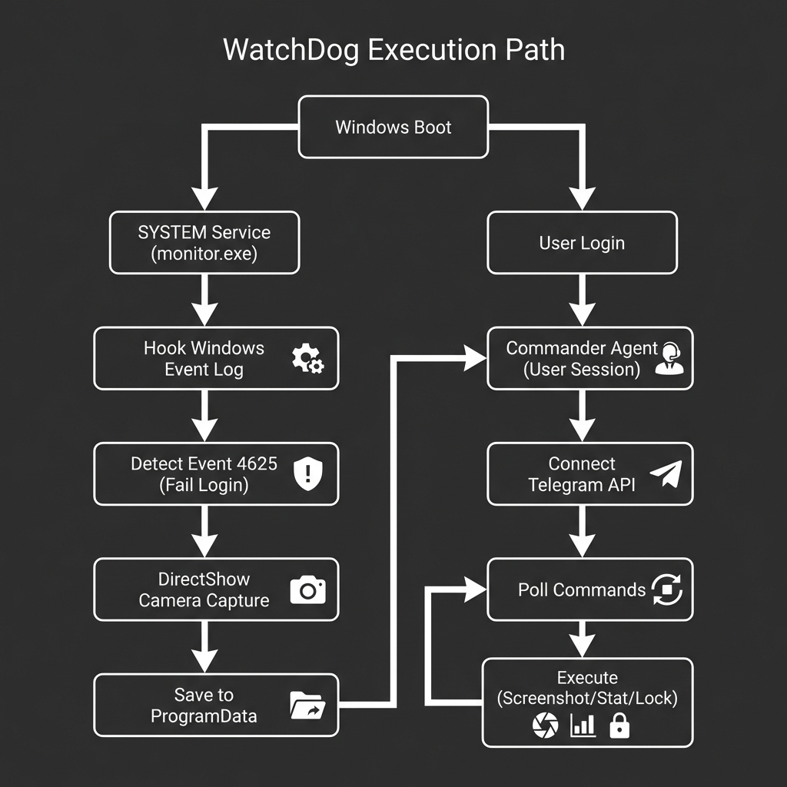

# 🔒 WATCHDOG - Advanced Anti-Theft System



A professional-grade, covert background service that transforms your Windows laptop into a smart security device. It silently monitors unauthorized access attempts and provides remote command capabilities via Telegram.

## ✨ Key Features

### 🕵️‍♂️ Automatic Protection
*   **Instant Intruder Selfies**: Automatically snaps a photo when someone types a wrong password/PIN (0.1s reaction time).
*   **System Event Monitoring**: Hooks into the Windows Security Log (Event ID 4625) for fail-safe detection.
*   **Offline Queueing**: If WiFi is off, photos are encrypted and queued, then silently uploaded the moment internet is restored.

### 🎮 Remote Command Center (Telegram)
Control your PC from anywhere using simple chat commands:
*   `/capture` - 📸 Take an instant spy photo from the webcam.
*   `/screen` - 🖥️ Get a live screenshot of what's on the screen.
*   `/locate` - 📍 Track location using IP and **WiFi Triangulation** (scans nearby WiFi networks).
*   `/stat` - 📊 View real-time system health (CPU, RAM, Battery, Boot Time).
*   `/lock` - 🔒 Remotely lock the workstation instantly.
*   `/msg "text"` - 💬 Display a popup message (e.g., "This device is stolen!").

---

## 🏗️ Technical Architecture

WatchDog uses a sophisticated **Dual-Process Architecture** to ensure maximum reliability and privilege separation.

### 1. The WatchDog Service (`SYSTEM` Context)
*   **Startup**: Runs strictly at **Boot** (before anyone logs in).
*   **Privileges**: `NT AUTHORITY\SYSTEM` (Highest possible Windows privilege).
*   **Function**:
    *   Anchors to the Windows Event Log API.
    *   Listens for **Logon Failure (Event 4625)** in real-time.
    *   Triggers the webcam directly via hardware APIs (OpenCV/DirectShow).
    *   Saves images to a hidden secure directory (`C:\ProgramData\AntiTheftCaptures`).
    *   *Note: Does not interact with the desktop UI (keeps it invisible).*

### 2. The Commander Agent (`User` Context)
*   **Startup**: Runs only **After Login**.
*   **Privileges**: Standard User.
*   **Function**:
    *   Connects to the Telegram Bot API via Long Polling.
    *   Executes UI-dependent tasks (Screenshots, Message Popups).
    *   Handling user commands like `/screen`, `/msg`, etc.

---

## 🛡️ Security & Evasion

**"Why doesn't Windows Defender block this?"**

WatchDog is designed to operate as a legitimate system utility rather than malware. It bypasses standard AV heuristics through several methods:

1.  **Trusted API Usage**:
    *   It uses Microsoft's **DirectShow API** (via OpenCV) for camera access, which is the standard, legal way for apps (like Zoom/Teams) to use the webcam. Defender sees this as standard hardware access, not spying.
2.  **No Code Injection**:
    *   Unlike Trojans, WatchDog runs in its own dedicated process (`monitor.exe`). It does not attempt to "hook" or "hollow" other processes (like `calc.exe` or `explorer.exe`), which is a primary red flag for Antivirus.
3.  **Authorized Execution**:
    *   Installation requires **Administrator** privileges. The Scheduled Tasks are created using the official windows `schtasks` utility. The OS trusts tasks that the Admin explicitly schedules.
4.  **Unique Signature**:
    *   Since you compile the executable locally (using `PyInstaller`), the file's cryptographic signature is unique to your machine. It does not match any known malware databases.

---

## 🚀 Quick Start

### 1. Install Dependencies
```powershell
pip install -r requirements.txt
```

### 2. Setup Telegram
Run the GUI setup to link your Telegram Bot:
```powershell
python setup/setup_gui.py
```

### 3. Build & Install (One-Click)
This script builds the executable, creates the hidden directories, and schedules the background tasks:
```powershell
powershell -ExecutionPolicy Bypass -File "setup/setup.ps1"
```

### 4. Verify
Restart your computer. Usage:
*   **Test Protection**: Enter a wrong PIN at the lock screen. Check your Telegram.
*   **Test Remote**: Open your Telegram bot and send `/stat`.

---

## 📁 Project Structure

```
Anti-Theft/
├── service/
│   ├── monitor.py          # The 'Brain' (Event Watcher)
│   ├── commander.py        # The 'Remote' (Telegram Listener)
│   ├── camera.py           # Hardware Access
│   └── uploader.py         # Network Manager
├── setup/
│   ├── setup.ps1           # Master Installer (Powershell)
│   ├── setup_gui.py        # Config Tool
│   └── install_startup.py  # Python Builder
├── dist/                   # Compiled Binaries
└── config.json             # Encrypted Settings
```

---

**Disclaimer**: This software is for **personal device protection only**. Installing on devices you do not own is a crime.
